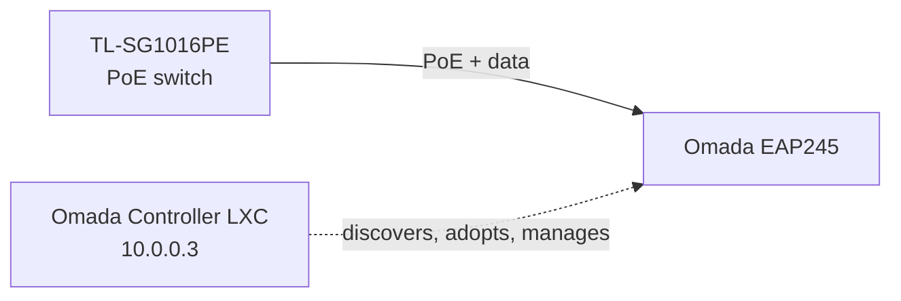

# 02: Enterprise Wi-Fi with Omada

[← Previous: pfSense](../01-pfSense-Firewall/README.md) · [Back to portfolio](../README.md) · [Next: Active Directory →](../03-Active-Directory-Lab/README.md)

> **Summary:** Deployed a controller-managed, PoE-powered enterprise access point, with the management controller running in a lightweight Linux container on Proxmox.

**Technologies:** Proxmox VE · LXC · Ubuntu · TP-Link Omada · PoE · VLANs (802.1Q)

---

## Build

1. **Controller:** Deployed the Omada Software Controller in an **Ubuntu LXC container** on Proxmox, with a static IP (`10.0.0.3`) so it's always reachable for management.
2. **Access point:** Installed an **Omada EAP245**, powered over Ethernet by the **TP-Link TL-SG1016PE** PoE switch.

---

## Challenges & Solutions

### 1. Controller installation failed

- **Problem:** Installing the controller by hand on Ubuntu 22.04 failed because of broken package dependencies (`mongodb`, `libssl1.1`).
- **Fix:** Researched the problem and switched to a well-known community install script. It added the right repositories and dependencies automatically, which gave a clean, repeatable install.

### 2. Access point would not adopt

- **Problem:** The controller couldn't discover the EAP245, even though both were on the same network.
- **Diagnosis:** The AP wasn't in a factory-default state, so it wasn't advertising itself for adoption.
- **Fix:** Did a **physical factory reset** (held the reset pinhole for 15 seconds). The AP came back up in *Pending Adoption*, and the controller adopted it right away.

---

## Outcome

A working, centrally managed Wi-Fi network. The controller and AP are ready for multiple SSIDs, each mapped to its own VLAN (for example guest, IoT, or lab).

**Skills demonstrated:** LXC deployment · Linux dependency troubleshooting · PoE · AP adoption & lifecycle · controller-based management
