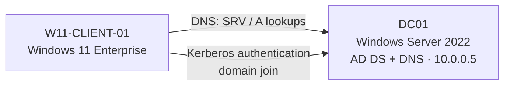

# 03: Active Directory Domain Lab

[← Previous: Omada Wi-Fi](../02-Omada-Controller/README.md) · [Back to portfolio](../README.md) · [Next: TrueNAS →](../04-TrueNAS-Storage/README.md)

> **Summary:** Built a small enterprise environment with a Windows Server 2022 domain controller and a domain-joined Windows 11 Enterprise client, and worked through a multi-step domain-join failure.

**Technologies:** Proxmox VE · Windows Server 2022 · Windows 11 Enterprise · AD DS · DNS · PowerShell · Group Policy

---

## Build

1. **Domain controller (DC01):** Deployed a Windows Server 2022 VM with a static IP (`10.0.0.5`) and installed the **AD DS** and **DNS Server** roles.
2. **Forest:** Promoted DC01 to a domain controller in a new forest (`robmox.lan`).
3. **Client:** Deployed a Windows 11 Enterprise VM that meets the **UEFI, Secure Boot, and TPM 2.0** requirements inside Proxmox, then joined it to the domain.

---

## Challenges & Solutions

### 1. Windows 11 installer blocked the VM

- **Problem:** The installer refused to continue without TPM 2.0 and Secure Boot.
- **Fix:** Changed the VM firmware to **OVMF (UEFI)**, then added an **EFI disk** (Secure Boot keys enrolled) and a virtual **TPM 2.0 state** device. The installer accepted the VM.

### 2. Domain join failed: "NTLM authentication disabled"

- **Problem:** The client couldn't join the domain and returned an NTLM error. That pointed to Kerberos failing and Windows falling back to NTLM, so the client couldn't properly locate or authenticate against the DC.
- **Fix (multi-step):**
  1. **Fix client DNS:** Set the client's adapter to use **only the domain controller** for DNS, so domain lookups stopped going to the router, which can't resolve AD records.
  2. **Remove the stale computer account:** In **Active Directory Users and Computers**, deleted the corrupted `PC01` computer object left by the first failed attempt.
  3. **Force a clean identity:** On the client, used PowerShell (`Remove-Computer`) to force-remove the broken trust, then **renamed the PC to `W11-CLIENT-01`** so it would rejoin as a completely fresh object. After that, the domain join went through.

---

## Outcome

A working Active Directory domain with a domain controller (`DC01`) and a domain-joined client (`W11-CLIENT-01`). It's the base for Group Policy, user/group management, and other enterprise services in the lab.

**Skills demonstrated:** AD DS deployment · AD-integrated DNS · domain join troubleshooting · ADUC · PowerShell · Windows 11 virtual TPM / Secure Boot
