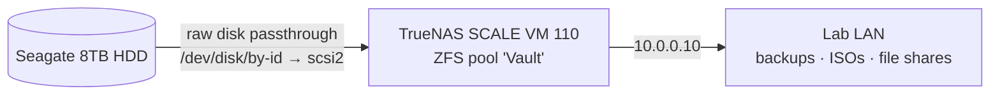

# 04: Network Storage with TrueNAS SCALE

[← Previous: Active Directory](../03-Active-Directory-Lab/README.md) · [Back to portfolio](../README.md) · [Next: Guest Network →](../05-Guest-Network-Isolation/README.md)

> **Summary:** Virtualized TrueNAS SCALE on Proxmox to give the lab centralized network storage for backups, ISOs, and file sharing. Storage management is kept separate from the hypervisor, and ZFS gets direct access to the physical disk.

**Technologies:** Proxmox VE · TrueNAS SCALE · OpenZFS · physical disk passthrough · Linux shell

---

## Architecture

| Component | Detail |
|-----------|--------|
| Hypervisor | Proxmox VE (node `robmox`) |
| Storage OS | TrueNAS SCALE (VM ID `110`) |
| Physical disk | Seagate Barracuda 8TB HDD |
| File system | OpenZFS, pool `Vault` |
| Network | Static IP `10.0.0.10` on `10.0.0.0/24` |



---

## Challenges & Solutions

### 1. Giving ZFS the real disk instead of a virtual one

- **Problem:** If TrueNAS stores its pool on a normal Proxmox virtual disk (a file or volume on the host's storage), ZFS is managing a virtual device instead of the real drive. That puts an extra layer between ZFS and the hardware and undermines the integrity guarantees ZFS is built around.
- **Fix:** From the Proxmox shell, found the drive's persistent ID and attached the **whole physical disk** directly to the VM, skipping the hypervisor's virtual-disk layer:

  ```bash
  # Find the drive's persistent ID (stays the same across reboots, unlike /dev/sdX)
  ls -l /dev/disk/by-id/

  # Attach the physical 8TB drive to VM 110 as SCSI device 2
  qm set 110 -scsi2 /dev/disk/by-id/ata-ST8000DM004-2CX188_<SERIAL>
  ```

  Using the `by-id` path instead of `/dev/sdX` means the right disk always goes to TrueNAS, even if device letters change after a reboot or hardware change.

---

## Outcome

A centralized ZFS storage server at `10.0.0.10` for lab backups, ISO images, and file sharing, with storage kept separate from the Proxmox host.

**Design note:** This is single-disk, raw-disk passthrough. ZFS can detect corruption but can't self-heal without a second disk, and SMART data isn't fully visible to the VM. Natural next steps are adding a mirror disk and passing through a dedicated HBA controller.

**Skills demonstrated:** TrueNAS SCALE · OpenZFS pools · Proxmox CLI (`qm`) · persistent device naming · storage architecture trade-offs
