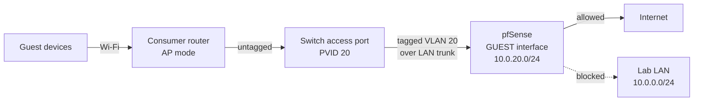

# 05: Guest Network Isolation

[← Previous: TrueNAS](../04-TrueNAS-Storage/README.md) · [Back to portfolio](../README.md) · [Next: Pi-hole DNS →](../06-Pi-hole-DNS/README.md)

> **Summary:** Designed and deployed an isolated guest network. Untrusted devices get internet access but can't reach the lab infrastructure.

**Technologies:** pfSense · VLANs (802.1Q) · switch PVID / access ports · firewall rules · hardware reuse

---

## Architecture

1. **Network design:** Created **VLAN 20** with its own subnet (`10.0.20.0/24`) and DHCP scope in pfSense, so guest traffic is separated at Layer 2 and filtered at Layer 3.
2. **Switch ports:** Set specific ports on the TL-SG1016PE as **untagged access ports for VLAN 20 (PVID 20)**. Anything plugged into those ports lands on the guest network before its traffic ever reaches the router.
3. **Wireless:** Repurposed a consumer router in **Access Point mode** as the guest Wi-Fi radio.

### Guest firewall rules (evaluated top to bottom)

| # | Action | Source | Destination | Purpose |
|---|--------|--------|-------------|---------|
| 1 | Pass | Guest | Pi-hole `10.0.0.6`, port 53 | DNS pinhole (added in [06](../06-Pi-hole-DNS/README.md)) |
| 2 | Block | Guest | LAN net | Keep guests out of the lab |
| 3 | Pass | Any | Any | Internet access |
| — | Deny | — | — | pfSense default deny |

---

## Challenges & Solutions

### 1. VLAN tagging on a non-VLAN-aware AP

- **Problem:** The consumer AP doesn't understand VLAN tags. At first, its traffic either leaked onto the wrong network or never reached the guest VLAN.
- **Fix:** Set the AP's switch port to **802.1Q untagged membership in VLAN 20 with PVID 20**. The switch now tags all untagged traffic from the AP as VLAN 20 as soon as it enters the backbone, so the AP never has to know about VLANs.

### 2. Guests got an IP but had no internet

- **Problem:** Guest devices got DHCP leases but couldn't browse. The pfSense **firewall logs** showed their packets hitting the **default deny** rule at the bottom of the list.
- **Diagnosis:** The source on the outbound pass rule was too narrow, so legitimate guest traffic didn't match it.
- **Fix:** Changed the pass rule's source to **Any** on the guest interface. Traffic now reaches the WAN gateway, and the **Block LAN** rule above it still stops anything headed for the lab.

---

## Outcome

A fully isolated guest network: guests have full internet access but are **blocked by firewall policy** from the management subnet and every internal server.

**Skills demonstrated:** VLAN design · 802.1Q tagging & PVIDs · firewall rule ordering · log-based troubleshooting · network segmentation
