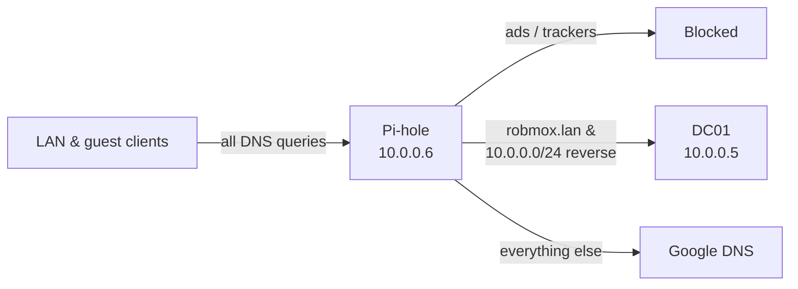

# 06: Centralized DNS & Ad-Blocking with Pi-hole

[← Previous: Guest Network](../05-Guest-Network-Isolation/README.md) · [Back to portfolio](../README.md)

> **Summary:** Set up network-wide ad and tracker blocking with Pi-hole, while keeping Active Directory name resolution working and extending DNS to the isolated guest VLAN.

**Technologies:** Pi-hole v6 · LXC · DNS · DHCP · conditional forwarding · Active Directory · pfSense firewall rules

---

## Architecture

1. **Deployment:** Deployed Pi-hole in a lightweight **LXC container** on Proxmox at `10.0.0.6`.
2. **DHCP integration:** Configured the pfSense DHCP server to hand out Pi-hole as the primary DNS server for all LAN clients.
3. **Split DNS:** Pi-hole sends public queries to an upstream resolver (Google) and sends local domain queries to the domain controller.

---

## Challenges & Solutions

### 1. Pi-hole broke Active Directory name resolution

- **Problem:** By default, Pi-hole sends every query to public upstream servers. Public DNS can't resolve internal names like `dc01.robmox.lan`, so AD lookups failed.
- **Fix:** Set up **conditional forwarding** (Pi-hole's reverse-server setting). Queries for the `robmox.lan` domain and reverse lookups for `10.0.0.0/24` now go to the domain controller (`10.0.0.5`) instead of the internet.

### 2. New Pi-hole v6 configuration syntax

- **Problem:** I deployed Pi-hole v6 while it was still in beta, and it used a new, poorly documented syntax for upstream and conditional-forwarding servers.
- **Fix:** Researched the new format and defined the DC target with an explicit port (`10.0.0.5#53`), so Pi-hole correctly sends local queries to the DC.

### 3. Guest VLAN couldn't reach Pi-hole

- **Problem:** The guest VLAN's **Block LAN** rule ([05](../05-Guest-Network-Isolation/README.md)) also blocked guests from reaching Pi-hole on the LAN.
- **Fix:** Added a narrow **pinhole**: a pass rule for **DNS (port 53) to `10.0.0.6` only**, placed **above** the Block LAN rule. I also set Pi-hole to accept queries from non-local subnets. Guests get filtered DNS and still can't reach anything else on the LAN.

---

## Outcome

Faster, cleaner browsing with ads and telemetry blocked for every device, guests included, and full compatibility with Active Directory.

**Skills demonstrated:** DNS architecture · conditional forwarding · AD DNS integration · DHCP options · least-privilege firewall pinholes · working from limited documentation
