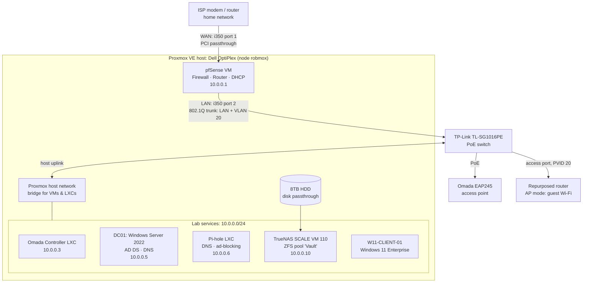

# IT Homelab Portfolio

Hands-on infrastructure I built, broke, and fixed on a single Proxmox server: a virtualized firewall, segmented networks, Active Directory, network storage, and centralized DNS. Each project write-up covers what I built, what went wrong, how I diagnosed it, and how I fixed it.

**Focus areas:** systems administration · networking & firewalls · Windows / Active Directory · virtualization · troubleshooting

---

## Projects

| # | Project | What it demonstrates |
|---|---------|----------------------|
| 01 | [Virtualized pfSense Firewall](./01-pfSense-Firewall/README.md) | PCI passthrough, routing/NAT, subnet planning, performance tuning |
| 02 | [Enterprise Wi-Fi with Omada](./02-Omada-Controller/README.md) | LXC containers, PoE, controller-managed APs, dependency troubleshooting |
| 03 | [Active Directory Domain Lab](./03-Active-Directory-Lab/README.md) | AD DS, DNS, domain join, Windows 11 TPM/Secure Boot, PowerShell |
| 04 | [Network Storage with TrueNAS SCALE](./04-TrueNAS-Storage/README.md) | ZFS, physical disk passthrough, centralized storage |
| 05 | [Guest Network Isolation](./05-Guest-Network-Isolation/README.md) | VLANs (802.1Q), switch PVIDs, firewall rule order |
| 06 | [Centralized DNS & Ad-Blocking with Pi-hole](./06-Pi-hole-DNS/README.md) | DNS, conditional forwarding, AD integration, cross-VLAN firewall rules |

---

## Lab Architecture

Everything runs on one power-efficient **Dell OptiPlex** running **Proxmox VE** (node `robmox`). A dual-port **Intel i350-T2 NIC** is passed directly to a **pfSense VM**: one port faces the ISP modem (WAN) and the other feeds a **TP-Link TL-SG1016PE** PoE switch (LAN). The whole lab sits on its own subnet behind pfSense, kept separate from the main home network.

### Network plan

| Network | Subnet | Purpose |
|---------|--------|---------|
| LAN (lab) | `10.0.0.0/24` | Servers, management, trusted clients |
| Guest (VLAN 20) | `10.0.20.0/24` | Untrusted devices: internet only, blocked from LAN (except DNS to Pi-hole) |

| Host | IP | Role |
|------|----|------|
| pfSense | `10.0.0.1` | Gateway, firewall, DHCP |
| Omada Controller | `10.0.0.3` | Wi-Fi management |
| DC01 | `10.0.0.5` | Domain controller + AD DNS (`robmox.lan`) |
| Pi-hole | `10.0.0.6` | Network-wide DNS, forwards local queries to DC01 |
| TrueNAS SCALE | `10.0.0.10` | Network storage |

---

## Skills Demonstrated

| Area | Skills | Projects |
|------|--------|----------|
| **Virtualization** | Proxmox VE, VMs vs. LXC containers, PCI passthrough, disk passthrough, UEFI/OVMF, virtual TPM 2.0 | 01, 02, 03, 04, 06 |
| **Networking** | Subnetting (RFC 1918), VLANs / 802.1Q, PVID tagging, DHCP, PoE | 01, 02, 05 |
| **Security** | Firewall rule design and ordering, network segmentation, guest isolation | 01, 05, 06 |
| **Windows & Identity** | Windows Server 2022, AD DS, domain join, ADUC, Windows 11 Enterprise, PowerShell | 03 |
| **DNS** | AD-integrated DNS, Pi-hole, conditional forwarding, split DNS | 03, 06 |
| **Storage** | TrueNAS SCALE, OpenZFS | 04 |
| **Linux** | Ubuntu LXC containers, package/dependency troubleshooting, shell administration | 02, 04, 06 |
| **Troubleshooting** | Reading firewall logs, isolating DNS/auth failures, performance tuning, factory reset/adoption | All |

### Hardware

- **Server:** Dell OptiPlex running Proxmox VE
- **NIC:** Intel i350-T2 dual-port gigabit (passed through to pfSense)
- **Switch:** TP-Link TL-SG1016PE (16-port, PoE, 802.1Q VLANs)
- **Wireless:** TP-Link Omada EAP245, plus a consumer router repurposed as a guest AP
- **Storage:** Seagate Barracuda 8TB HDD

---

## Troubleshooting Highlights

Some of the more interesting problems from these builds:

- **Gigabit internet capped at ~600 Mbps** → traced to TSO/LRO hardware offloading; disabled it in pfSense system tunables to get back to 900+ Mbps. *([01](./01-pfSense-Firewall/README.md))*
- **Windows 11 client wouldn't join the domain** → fixed client DNS, removed a stale computer object in AD, and forced a clean disjoin/rename with PowerShell. *([03](./03-Active-Directory-Lab/README.md))*
- **Guests got an IP but had no internet** → read the firewall logs, found traffic hitting the default-deny rule, and fixed the rule source and ordering. *([05](./05-Guest-Network-Isolation/README.md))*
- **Pi-hole broke Active Directory name resolution** → set up conditional forwarding so `robmox.lan` queries go to the domain controller. *([06](./06-Pi-hole-DNS/README.md))*
